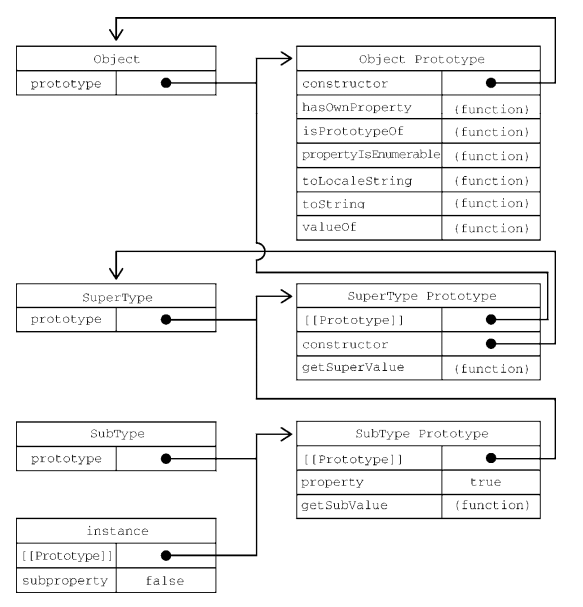
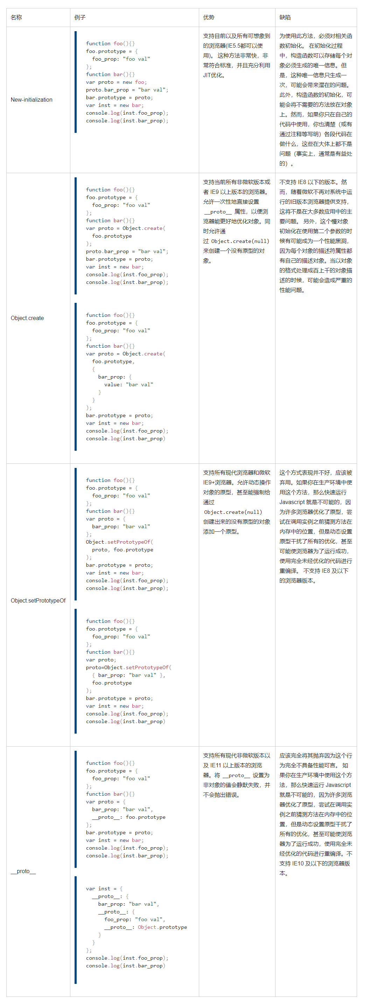

# js基础-继承与原型链

## 理解原型设计模式 JavaScript中的原型规则

**继承与原型链**
当谈到继承时，JavaScript 只有对象结构。每个实例对象（ object ）都有一个 __proto__ 指向它的构造函数的原型prototype。该原型对象也有一个 __proto__ ，层层向上直到Object再到null。null 没有原型，并作为这个原型链中的最后一个环节。几乎所有 JavaScript 中的对象都是位于原型链顶端的 Object 的实例。

**继承属性**
有了原型链,当试图访问一个对象的属性时，不仅仅在该对象上搜寻，还会搜寻原型链，直到找到一个名字匹配的属性或到达原型链的末尾。
在原型链上查找属性比较耗时，可以使用 `hasOwnProperty/Object.keys()` 处理属性并且不会遍历原型链的方法
函数的继承与其他的属性继承没有差别



### 使用不同的方法来 创建对象和生成原型链

**使用语法结构创建的对象**

```js
var o = {a: 1};

// o 这个对象继承了 Object.prototype 上面的所有属性
// o 自身没有名为 hasOwnProperty 的属性
// hasOwnProperty 是 Object.prototype 的属性
// 因此 o 继承了 Object.prototype 的 hasOwnProperty
// Object.prototype 的原型为 null
// 原型链如下:
// o ---> Object.prototype ---> null

var a = ["yo", "whadup", "?"];

// 数组都继承于 Array.prototype
// (Array.prototype 中包含 indexOf, forEach 等方法)
// 原型链如下:
// a ---> Array.prototype ---> Object.prototype ---> null

function f(){
  return 2;
}

// 函数都继承于 Function.prototype
// (Function.prototype 中包含 call, bind等方法)
// 原型链如下:
// f ---> Function.prototype ---> Object.prototype ---> null
```

**使用构造器创建的对象**

在 JavaScript 中，构造器其实就是一个普通的函数。当使用 new 操作符 来作用这个函数时，它就可以被称为构造方法（构造函数）。

```js
function Graph() {
  this.vertices = [];
  this.edges = [];
}

Graph.prototype = {
  addVertex: function(v){
    this.vertices.push(v);
  }
};

var g = new Graph();
// g 是生成的对象，他的自身属性有 'vertices' 和 'edges'。
// 在 g 被实例化时，g.[[Prototype]] 指向了 Graph.prototype。
```

**使用 Object.create 创建的对象**
ECMAScript 5 中引入了一个新方法：Object.create()。可以调用这个方法来创建一个新对象。新对象的原型就是调用 create 方法时传入的第一个参数

```js
var a = {a: 1};
// a ---> Object.prototype ---> null

var b = Object.create(a);
// b ---> a ---> Object.prototype ---> null
console.log(b.a); // 1 (继承而来)

var c = Object.create(b);
// c ---> b ---> a ---> Object.prototype ---> null

var d = Object.create(null);
// d ---> null
console.log(d.hasOwnProperty); // undefined, 因为d没有继承Object.prototype
```

**使用 class 关键字创建的对象**

```js
"use strict";

class Polygon {
  constructor(height, width) {
    this.height = height;
    this.width = width;
  }
}

class Square extends Polygon {
  constructor(sideLength) {
    super(sideLength, sideLength);
  }
  get area() {
    return this.height * this.width;
  }
  set sideLength(newLength) {
    this.height = newLength;
    this.width = newLength;
  }
}

var square = new Square(2);
```

### 4 个用于拓展原型链的方法



## new一个对象的详细过程 手动实现一个new操作符

new一个对象的详细过程

1. 创建一个临时对象
2. 临时对象被执行[[Prototype]]连接
3. 用临时对象call构造函数
4. 如果构造函数中没有返回其它对象就返回临时对象，否则返回构造函数中返回的对象。

用函数实现new

```js
function _new(constructor, ...args) {
  const obj = {}
  obj.__proto__ = constructor.prototype
  const result = constructor.apply(obj, args) 
  return result instanceof Object ? result : obj
}
```

## instanceof的底层实现原理 手动实现一个instanceof

手写
①L表示对象实例，R表示构造函数或者父类型实例
②取R的显式原型，取L的隐式原型
③循环遍历，进行判断②中的两个值是否相等，相等返回true，不相等继续查找L的原型链

```js
function instance_of(L, R) {
    var O = R.prototype; 
    L = L.__proto__;
    while (true) {    
        if (L === null)      
             return false;   
        if (O === L) 
             return true;   
        L = L.__proto__;  
    }
}
```

`instanceof` 操作符可以用来确定一个对象实例的原型链上是否有某个原型。在 ES6 中，`instanceof` 操作符会使用 `Symbol.hasInstance` 函数来确定关系，以 Symbol.hasInstance 为键的函数会执行同样的操作，只是操作数对调了一下

### Symbol.hasInstance

该方法决定一个构造器对象是否认可一个对象是它的实例。这个属性定义在 Function 的原型上，因此默认在所有函数和类上都可以调用。可以在继承的类上通过静态方法重新定义这个函数。

```js
function Foo() {} 
let f = new Foo(); 
console.log(Foo[Symbol.hasInstance](f)); // true

class Bar{}
class Baz extends Bar {
  static [Symbol.hasInstance]() {
    return false
  }
}

let b = new Baz()
console.log(Bar[Symbol.hasInstance](b)) // true
console.log(b instanceof Bar) // true
console.log(Baz[Symbol.hasInstance](b)) // false
console.log(b instanceof Baz) // true
```

**`instanceof` 和多全局对象**
多个 frame 或多个 window 之间的交互，多个窗口意味着多个全局环境，不同的全局环境拥有不同的全局对象，从而拥有不同的内置类型构造函数这时利用instanceof去判断某些类型可能会错误
例

```js
Array.prototype !== window.frames[0].Array.prototype
[] instanceof window.frames[0].Array
```

使用 `Array.isArray(myObj)` 或者 `Object.prototype.toString.call(myObj) === "[object Array]"` 来安全的检测传过来的对象是否是一个数组。

## 实现继承的几种方式以及他们的优缺点

**概念**
很多面向对象语言都支持两种继承：接口继承和实现继承。前者只继承方法签名，后者继承实际的方法。
接口继承在 ECMAScript 中是不可能的，因为函数没有签名。
实现继承是 ECMAScript 唯一支持的继承方式，而这主要是通过原型链实现的。基本技术是 `原型链继承` 、`构造函数借用` 两个不同的路线

构造函数、原型和实例的关系：每个构造函数都有一个原型对象，原型有一个属性指回构造函数，而实例有一个内部指针指向原型

<https://juejin.im/post/58f94c9bb123db411953691b#heading-2>

```js
// JavaScript常用八种继承方案
// https://juejin.cn/post/6844903696111763470
// 1. 原型链继承
function SuperType() {
  this.property = true;
}

SuperType.prototype.getSuperValue = function() {
  return this.property
}

function SubType() {
  this.subproperty = false;
}

// 继承SuperType
SubType.prototype = new SuperType();

SubType.prototype.getSubValue = function () {
  return this.subproperty;
}

let instance = new SubType();
console.log(instance.getSuperValue()); // true

// 原型链方案存在的缺点：多个实例对引用类型的操作会被篡改。
// 问题二：子类型实例化时不能给父类型的构造函数传参
```

```js
// 2. 盗用构造函数继承
function SuperType() {
    this.colors = ['red', 'blue', 'green']
}

function SubType() {
    // 继承SuperType
    SuperType.call(this)
}

let instance1 = new SubType()
instance1.colors.push('black')
console.log(instane1.colors) // red, blue, green, black

let instance2 = new SubType()
console.log(instance2.colors) // red, blue, green

// 使用父类的构造函数来增强子类实例，等同于复制父类的实例给子类（不使用原型）
// 创建子类实例时用this去call父类构造函数，于是SubType的每个实例都会将SuperType中的属性复制一份。

// 缺点：
// 只能继承父类的实例属性和方法，不能继承原型属性/方法
// 无法实现复用，每个子类都有父类实例函数的副本，影响性能
```

```js
// 3. 组合继承
function SuperType(name) {
    this.name = name
    this.colors = ['red', 'blue', 'green']
}
SuperType.prototype.sayName = function () {
    console.log(this.name)
}

function SubType(name, age) {
    // 继承属性
    SuperType.call(this, name);
    this.age = age
}
// 继承方法
SubType.prototype = new SuperType(); 
SubType.prototype.sayAge = function() { 
 console.log(this.age); 
}; 

let instance1 = new SubType("Nicholas", 29); 
instance1.colors.push("black"); 
console.log(instance1.colors); // "red,blue,green,black" 
instance1.sayName(); // "Nicholas"; 
instance1.sayAge(); // 29 
let instance2 = new SubType("Greg", 27); 
console.log(instance2.colors); // "red,blue,green" 
instance2.sayName(); // "Greg"; 
instance2.sayAge(); // 27

// 组合上述两种方法就是组合继承。用原型链实现对原型属性和方法的继承，用借用构造函数技术来实现实例属性的继承。
// 缺点：调用了两次父类构造函数
// 第一次调用SuperType()：给SubType.prototype写入两个属性name，color。
// 第二次调用SuperType()：给instance1写入两个属性name，color。
```

```js
// 4. 寄生组合继承
// 只调用了一次SuperType 构造函数，并且因此避免了在SubType.prototype 上创建不必要的、多余的属性。
// 于此同时，原型链还能保持不变；因此，还能够正常使用instanceof 和isPrototypeOf()
function inheritPrototype (subType, superType) {
    var prototype = Object.create(superType.prototype) // 创建对象，创建父类原型的一个副本
    prototype.constructor = subType                    // 增强对象，弥补因重写原型而失去的默认的constructor 属性
    subType.prototype = prototype                      // 指定对象，将新创建的对象赋值给子类的原型
}

// 父类初始化实例属性和原型属性
function SuperType (name) {
    this.name = name
    this.colors = ["red", "blue", "green"]
}
SuperType.prototype.sayName = function () {
    console.log(this.name)
}

// 借用构造函数传递增强子类实例属性（支持传参和避免篡改）
function SubType (name, age) {
    SuperType.call(this, name)
    this.age = age
}

// 将父类原型指向子类
inheritPrototype(SubType, SuperType)

// 新增子类原型属性
SubType.prototype.sayAge = function () {
    console.log(this.age)
}

var instance1 = new SubType("xyc", 23)
var instance2 = new SubType("lxy", 23)

instance1.colors.push("2") // ["red", "blue", "green", "2"]
instance1.colors.push("3") // ["red", "blue", "green", "3"]
```

```js
// 5. es6 class
class Rectangle {
    // constructor
    constructor (height, width) {
        this.height = height
        this.width = width
    }

    // Getter
    get area () {
        return this.calcArea()
    }

    // Method
    calcArea () {
        return this.height * this.width
    }
}

const rectangle = new Rectangle(10, 20)
console.log(rectangle.area)
// 输出 200
// 继承
class Square extends Rectangle {

    constructor (length) {
        super(length, length)

        // 如果子类中存在构造函数，则需要在使用“this”之前首先调用 super()。
        this.name = 'Square'
    }

    get area () {
        return this.height * this.width
    }
}

const square = new Square(10)
console.log(square.area)
// 输出 100
```

## 理解es6 class构造以及继承的底层实现原理

**类实现**
class的底层依然是构造函数
构造实例时

1. 调用_classCallCheck方法判断当前函数调用前是否有new关键字
   构造函数执行前有new关键字，会在构造函数内部创建一个空对象，
   将构造函数的prototype指向这个空对象的__prpto__，并将this指向这个空对象。
   若构造函数前面没有new则构造函数的prototype不会出现在this的原型链上，返回false
2. 将class内部的变量、函数赋值给this
3. 执行constructor内部的逻辑
4. return this（构造函数默认在最后帮我们做了这一步）

```js
// 转换前
class Parent {
  constructor(a){
    this.filed1 = a;
  }
  filed2 = 2;
  func1 = function(){}
}


// 转换后
function _classCallCheck(instance, Constructor) {
  // instanceof 检测构造函数的 prototype 属性是否出现在某个实例对象的原型链上。
  if (!(instance instanceof Constructor)) {
    throw new TypeError("Cannot call a class as a function");
  }
}
var Parent = function Parent(a) {
  _classCallCheck(this, Parent);
  this.filed2 = 2;
  this.func1 = function () { };
  this.filed1 = a;
};
```

**继承实现**
调用_inherits函数继承父类的prototype
_inherits内部：

1. 校验父类是不是构造函数
2. 寄生继承：
   用父类构造函数的prototype创建一个对象，
   这个对象的构造函数指向子类构造函数
   赋值给子类构造函数的prototype
3. 将父构造函数指向子构造函数的_proto_

构造实例时

1. 调用_classCallCheck方法检查new
2. 用当前this调用父类构造函数
   (Child.__proto__ || Object.getPrototypeOf(Child)).call(this, a)实际上是父构造函数，
   然后通过call将其调用方改为当前this，并传递参数
   _possibleConstructorReturn校验this是否被初始化，super是否调用，并返回父类已经赋值完的this
3. 执行子类class内部的变量和函数赋给this
4. 执行子类constructor内部逻辑

  
```js
// 转换前
class Child extends Parent {
    constructor(a,b) {
      super(a);
      this.filed3 = b;
    }
  filed4 = 1;
  func2 = function(){}
}

// 转换后
var Child = function (_Parent) {
  function Child(a, b) {
    _classCallCheck(this, Child);
    var _this = _possibleConstructorReturn(this, (Child.__proto__ || Object.getPrototypeOf(Child)).call(this, a));
    _this.filed4 = 1;
    _this.func2 = function () {};
    _this.filed3 = b;
    return _this;
  }
  _inherits(Child, _Parent);
  return Child;
}(Parent);

function _inherits(subClass, superClass) {
  if (typeof superClass !== "function" && superClass !== null) {
    throw new TypeError("Super expression must either be null or a function, not " + typeof superClass);
  }
  subClass.prototype = Object.create(superClass && superClass.prototype, {
    constructor: { value: subClass, enumerable: false, writable: true, configurable: true }
  });
  if (superClass)
    Object.setPrototypeOf ? Object.setPrototypeOf(subClass, superClass) : subClass.__proto__ = superClass;
}

function _possibleConstructorReturn(self, call) {
  if (!self) {
    throw new ReferenceError("this hasn't been initialised - super() hasn't been called");
  }
  return call && (typeof call === "object" || typeof call === "function") ? call : self;
}
```

默认的构造函数中会主动调用父类构造函数，并默认把当前constructor传递的参数传给了父类。所以当我们声明了constructor后必须主动调用super(),否则无法调用父构造函数，无法完成继承。典型的例子就是Reatc的Component中，我们声明constructor后必须调用super(props)，因为父类要在构造函数中对props做一些初始化操作。

## 开源项目(如Node)中应用原型继承的案例


