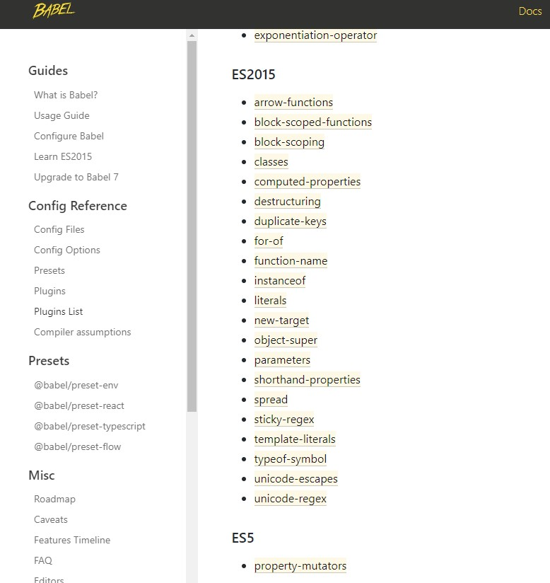

# Babel基础

转载自[「前端基建」带你在Babel的世界中畅游](https://juejin.cn/post/7025237833543581732)

## Babel日常用法

### plugin 和 Preset

所谓 **`Preset` 就是一些 `Plugin` 组成的合集**,你可以将Preset理解称为就是一些的Plugin整合称为的一个包。

#### 常见Preset

`babel-preset-env`

`@babel/preset-env` 是一个智能预设，它可以将我们的高版本JavaScript代码进行转译根据内置的规则转译成为低版本的javascript代码。
`preset-env` 内部集成了绝大多数plugin（State > 3）的转译插件，它会根据对应的参数进行代码转译。
> 需要额外注意的是 `babel-preset-env` 仅仅针对语法阶段的转译，比如转译箭头函数，`const/let` 语法。针对一些Api或者ES6内置模块的 `polyfill` ，preset-env是无法进行转译的。这块内容我们会在之后的polyfill中为大家进行详细讲解。

`babel-preset-react`

通常我们在使用 `React` 中的 `jsx` 时，相信大家都明白实质上jsx最终会被编译称为 `React.createElement()` 方法。
`babel-preset-react` 这个预设起到的就是将jsx进行转译的作用。

`babel-preset-typescript`

对于TypeScript代码，我们有两种方式去 `编译TypeScript代码` 成为JavaScript代码。

1. 使用 `tsc` 命令，结合 `cli` 命令行参数方式或者 `tsconfig` 配置文件进行编译ts代码。
2. 使用 `babel` ，通过 `babel-preset-typescript` 代码进行编译ts代码。

#### 常见Plugin

Babel官网列举出了一份非常详尽的 [Plugin List](https://link.juejin.cn/?target=https%3A%2F%2Fbabeljs.io%2Fdocs%2Fen%2Fplugins-list)



### 前端基建中的Babel配置详解

关于前端构建工具，无论使用的是 `webapack` 还是 `rollup` 又或是其他，内部都离不开 `Babel` 相关配置。

关于 `WebPack` 中我们日常使用的 `babel` 相关配置主要涉及以下三个相关插件:

- `babel-loader`
- `babel-core`
- `babel-preset-env`

#### babel-loader

`webpack` 中 `loader` 的本质就是一个函数，接受我们的源代码作为入参同时返回新的内容。所以 `babel-loader` 的本质就是一个函数，我们匹配到对应的 `jsx?/tsx?` 的文件交给 `babel-loader`:

```js
/**
 * 
 * @param sourceCode 源代码内容
 * @param options babel-loader相关参数
 * @returns 处理后的代码
 */
function babelLoader (sourceCode,options) {
  // ..
  return targetCode
}
```

> 关于 `options` ，`babel-loader` 支持直接通过 `loader` 的参数形式注入，同时也在loader函数内部通过读取 `.babelrc/babel.config.js/babel.config.json` 等文件注入配置。

#### babel-core

`babel-loader` 仅仅是识别匹配文件和接受对应参数的函数，那么 `babel` 在编译代码过程中核心的库就是 `@babel/core` 这个库。
`babel-core` 是 `babel` 最核心的一个编译库，他可以将我们的代码进行**词法分析--语法分析--语义分析**过程从而生成 `AST` 抽象语法树，从而对于“这棵树”的操作之后再通过编译称为新的代码。
`babel-core` 其实相当于 `@babel/parse` 和 `@babel/generator` 这两个包的合体
`babel-core` 通过 `transform` 方法将我们的代码进行编译。

关于 `babel-core` 中的编译方法其实有很多种，比如直接接受字符串形式的 `transform` 方法或者接受js文件路径的 `transformFile` 方法进行文件整体编译。
同时它还支持同步以及异步的方法，[文档](https://babeljs.io/docs/en/babel-core)

```js
const core = require('@babel/core')

/**
 * 
 * @param sourceCode 源代码内容
 * @param options babel-loader相关参数
 * @returns 处理后的代码
 */
function babelLoader (sourceCode,options) {
  // 通过transform方法编译传入的源代码
  core.transform(sourceCode)
  return targetCode
}
```

#### babel-preset-env

针对代码的转译我们需要告诉 **`babel`以什么样的规则进行转化** ，比如我需要告诉babel：“嘿，babel。将我的这段代码转化称为EcmaScript 5版本的内容！”。

```js
const core = require('@babel/core');

/**
 *
 * @param sourceCode 源代码内容
 * @param options babel-loader相关参数
 * @returns 处理后的代码
 */
function babelLoader(sourceCode, options) {
  // 通过transform方法编译传入的源代码
  core.transform(sourceCode, {
    presets: ['babel-preset-env'],
    plugins: [...]
  });
  return targetCode;
}
```

### `Babel` 相关 `polyfill` 内容

- 最新 `ES语法`，比如：箭头函数，let/const。
- 最新 `ES Api`，比如 `Promise`
- 最新 `ES实例/静态方法`，比如 `String.prototype.include`

`babel-prest-env` 仅仅只会转化最新的es语法，并不会转化对应的Api和实例方法，实现这部分内容的低版本代码实现需要一系列类似"垫片"的工具。

针对于 `polyfill` 方法的内容，babel中涉及两个方面来解决：

- `@babel/polyfill`
- `@babel/runtime`
- `@babel/plugin-transform-runtime`

第一种实现 `polyfill` 的方式：

通过 `@babel/polyfill` 通过往全局对象上添加属性以及直接修改内置对象的 `Prototype` 上添加方法实现 `polyfill` 。
比如说我们需要支持 `String.prototype.include`，在引入 `@babel/polyfill` 这个包之后，它会在全局 `String` 的原型对象上添加 `include`方法从而支持我们的Js Api。
我们说到这种方式本质上是往全局对象/内置对象上挂载属性，所以这种方式难免会造成全局污染。

**应用 `@babel/polyfill`**
在 `babel-preset-env` 中存在一个 `useBuiltIns` 参数，这个参数决定了如何在 `preset-env` 中使用 `@babel/polyfill` 。

```json
{
    "presets": [
        ["@babel/preset-env", {
            "useBuiltIns": false
        }]
    ]
}
```

`useBuiltIns`--`"usage"`| `"entry"` | `false`

- false: 当我们使用 `preset-env` 传入 `useBuiltIns` 参数时候，默认为false。它表示仅仅会转化最新的ES语法，并不会转化任何Api和方法。
- entry: 当传入 `entry` 时，需要我们在项目入口文件中手动引入一次 `core-js`，它会根据我们配置的浏览器兼容性列表(`browserList`)然后全量引入不兼容的 `polyfill`。在 `Babel7.4.0` 之后，[@babel/polyfill](https://babeljs.io/docs/en/babel-polyfill) 被废弃它变成另外两个包的集成。`core-js/stable` `regenerator-runtime/runtime` ，但是他们的使用方式是一致的，只是在入口文件中引入的包不同了。[浏览器兼容性列表配置方式](https://github.com/browserslist/browserslist)。同时需要注意的是，在我们使用 `useBuiltIns:entry/usage` 时，需要额外指定 `core-js` 这个参数。默认为使用 `core-js 2.0`，所谓的 `core-js` 就是我们上文讲到的“垫片”的实现。它会实现一系列内置方法或者 `Promise等Api`。`core-js 2.0` 版本是跟随 `preset-env` 一起安装的，不需要单独安装。
- usage: 